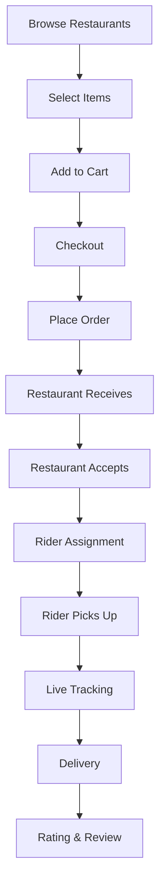

<div align="center">

# 🚚 LuckWay

### Web-Based Food Delivery Platform with Real-Time Tracking

[](#)
[](#)
[](#)


</div>

---

## 🎯 Project Overview

**LuckWay** is a comprehensive web-based food delivery platform similar to Uber Eats, featuring real-time GPS tracking, interactive maps, and a multi-user system connecting restaurants, customers, and delivery riders. Built from the ground up to solve modern food delivery challenges with cutting-edge web technologies.

<div align="center">

| 🏢 **Project Type** | 🎯 **Complexity** | 🚀 **Platform** | ⚡ **Status** |
|:-------------------:|:-----------------:|:---------------:|:-------------:|
| Full-Stack Web App | Enterprise Level | Web-Based | Production Ready |

</div>

---

## 💼 Professional Highlights

<table>
<tr>
<td width="33%" align="center">

### 🗺️ Live Tracking
**Real-Time GPS Integration**  
Google Maps API with live rider location updates

</td>
<td width="33%" align="center">

### 🔄 Multi-User System
**3 User Types**  
Restaurants, Customers, and Delivery Riders

</td>
<td width="33%" align="center">

### ⚡ Real-Time Updates
**WebSocket/AJAX**  
Live order status and location tracking

</td>
</tr>
</table>

---

## ✨ Core Features

### 👥 Multi-User Architecture

<table>
<tr>
<td width="33%">

#### 🍽️ **Restaurant Panel**
- Menu management system
- Order receiving & processing
- Real-time order notifications
- Sales analytics dashboard
- Business profile management
- Order history tracking

</td>
<td width="33%">

#### 🛒 **Customer Portal**
- Browse restaurants & menus
- Shopping cart system
- Order placement
- Live delivery tracking on map
- Order history
- Rating & review system

</td>
<td width="33%">

#### 🏍️ **Rider Application**
- Accept/reject orders
- GPS navigation integration
- Route optimization
- Earnings tracker
- Delivery history
- Real-time status updates

</td>
</tr>
</table>

### 🗺️ Advanced Map Integration

```javascript
✓ Google Maps API integration
✓ Real-time rider location tracking
✓ Customer location pin on map
✓ Dynamic route visualization
✓ Distance calculation
✓ ETA (Estimated Time of Arrival)
✓ Geolocation services
✓ Interactive map markers
```

### 📍 Location Features

```javascript
✓ Customer address auto-complete
✓ Delivery zone validation
✓ Multi-location restaurant support
✓ GPS-based rider tracking
✓ Live position updates (every 5-10 seconds)
✓ Distance & duration calculations
✓ Map-based order assignment
```

---

## 🛠️ Technical Stack

<div align="center">

### Core Technologies


</div>

### System Architecture

```
┌─────────────────────────────────────────────────────────────┐
│                   PRESENTATION LAYER                        │
│  • Responsive Web Interface (Mobile + Desktop)              │
│  • Bootstrap 5 Framework                                    │
│  • JavaScript ES6+ / AJAX                                   │
│  • Google Maps JavaScript API                               │
└─────────────────────────────────────────────────────────────┘
                            ↓
┌─────────────────────────────────────────────────────────────┐
│                   APPLICATION LAYER                         │
│  • PHP 7.4+ Backend Logic                                   │
│  • RESTful API Endpoints                                    │
│  • Real-Time Location Processing                            │
│  • Order Management System                                  │
│  • Authentication & Authorization                           │
└─────────────────────────────────────────────────────────────┘
                            ↓
┌─────────────────────────────────────────────────────────────┐
│                   DATA LAYER                                │
│  • MySQL Database                                           │
│  • Normalized Schema Design                                 │
│  • Geospatial Data Storage                                  │
│  • Session Management                                       │
└─────────────────────────────────────────────────────────────┘
                            ↓
┌─────────────────────────────────────────────────────────────┐
│                   INTEGRATION LAYER                         │
│  • Google Maps API (Geolocation)                            │
│  • Payment Gateway Integration                              │
│  • SMS/Email Notification Services                          │
└─────────────────────────────────────────────────────────────┘
```

---

## 🚀 Key Technical Implementations

### 🗺️ Real-Time Location Tracking

```javascript
// GPS Tracking System
✓ Geolocation API for rider position
✓ AJAX polling (5-10 second intervals)
✓ Database updates with lat/long coordinates
✓ Map marker updates in real-time
✓ Distance calculation using Haversine formula
✓ ETA estimation based on distance & speed
✓ Route polyline rendering on map
```

### 📱 Order Flow System

```
Customer → Browse Restaurants → Add to Cart → Place Order
     ↓
Restaurant Receives Order → Accepts → Prepares Food
     ↓
Rider Gets Notification → Accepts → Picks Up → Delivers
     ↓
Live Tracking Updates → Customer Sees Rider Location
     ↓
Delivery Completed → Rating & Review
```

### 🔐 Authentication System

```php
✓ Multi-role authentication (Restaurant/Customer/Rider)
✓ Secure password hashing (bcrypt)
✓ Session-based login system
✓ Role-based access control (RBAC)
✓ Protected routes and middleware
✓ Remember me functionality
✓ Password reset flow
```

---

## 🎨 Features Breakdown

### 🛒 Customer Features

<table>
<tr>
<td width="50%">

**Ordering Experience**
- Restaurant search & filtering
- Category-based browsing
- Menu item selection
- Customization options
- Shopping cart management
- Order checkout process
- Multiple payment methods
- Order confirmation

</td>
<td width="50%">

**Tracking & Management**
- Real-time order tracking
- Live rider location on map
- Order status updates
- Delivery ETA display
- Order history
- Reorder functionality
- Rating & review system
- Support/help center

</td>
</tr>
</table>

### 🍽️ Restaurant Features

<table>
<tr>
<td width="50%">

**Menu Management**
- Add/edit/delete menu items
- Category organization
- Price management
- Item availability toggle
- Image upload for dishes
- Description & details
- Special offers/discounts
- Menu item modifiers

</td>
<td width="50%">

**Order Management**
- Real-time order notifications
- Accept/reject orders
- Preparation time setting
- Order ready notification
- Order history & analytics
- Sales reports
- Customer feedback view
- Business hours management

</td>
</tr>
</table>

### 🏍️ Rider Features

```javascript
✓ Order assignment notifications
✓ Accept/reject delivery requests
✓ Navigation to restaurant
✓ Pick-up confirmation
✓ Navigation to customer
✓ Delivery confirmation
✓ Earnings tracking
✓ Performance metrics
✓ Delivery history
✓ Live GPS tracking toggle
```

---

## 🗺️ Google Maps Integration

### Map Features Implemented

```javascript
// Core Map Functionality
1. Map Initialization
   - Center on user's location
   - Custom map styling
   - Zoom controls

2. Marker System
   - Restaurant locations
   - Customer delivery address
   - Live rider position marker
   - Custom marker icons

3. Route Visualization
   - Polyline from restaurant to customer
   - Dynamic route updates
   - Distance & duration display

4. Geolocation Services
   - Browser geolocation API
   - Continuous position tracking
   - Location accuracy handling

5. Place Autocomplete
   - Address search
   - Location suggestions
   - Place details retrieval
```


## 🔧 Technical Achievements

### Real-Time Systems

```diff
+ Implemented real-time GPS tracking with 10-second updates
+ AJAX polling for order status changes
+ Live map updates without page refresh
+ Efficient database queries for location data
+ Optimized API calls to Google Maps
```

### Performance Optimization

```diff
+ Lazy loading for restaurant listings
+ Image compression for menu items
+ Cached Google Maps API responses
+ Database indexing on location queries
+ Minified JavaScript for faster load times
```

### User Experience

```diff
+ Intuitive map interface
+ Mobile-responsive design
+ Fast checkout process
+ Real-time order notifications
+ Smooth animations and transitions
```

---

## 💡 Complex Problem Solving

### Challenge 1: Real-Time Location Tracking

**Problem:** Need to show rider location to customers in real-time without excessive server load

**Solution:**
- Implemented AJAX polling with 5-10 second intervals
- Used database indexing on rider_locations table
- Cached rider positions with timestamp validation
- Only fetch active order locations
- Reduced API calls by batching updates

### Challenge 2: Distance & ETA Calculation

**Problem:** Calculate accurate distance and delivery time between multiple points

**Solution:**
- Integrated Google Distance Matrix API
- Implemented Haversine formula for quick estimates
- Calculated average rider speed from historical data
- Dynamic ETA updates based on real-time position
- Account for traffic conditions using Google APIs

### Challenge 3: Order Assignment Logic

**Problem:** Efficiently assign orders to available riders based on location

**Solution:**
- Calculate distance from rider to restaurant
- Check rider availability status
- Prioritize nearest riders
- Queue system for busy periods
- Manual override option for restaurants

### Challenge 4: Map Performance

**Problem:** Slow map rendering with multiple markers and routes

**Solution:**
- Clustered restaurant markers for distant locations
- Lazy load markers as user pans the map
- Optimized polyline rendering
- Cached map tiles
- Used marker pooling for updates

---

## 📊 System Workflow

### Customer Order Journey



---

## 🎯 Skills Demonstrated

<div align="center">

| **Backend** | **Frontend** | **APIs & Integration** | **Database** |
|:-----------:|:------------:|:----------------------:|:------------:|
| PHP | HTML5/CSS3 | Google Maps API | MySQL |
| RESTful APIs | JavaScript ES6+ | Geolocation API | Spatial Queries |
| Authentication | Bootstrap 5 | Distance Matrix API | Normalization |
| Session Mgmt | AJAX/Fetch | Places API | Indexing |
| File Upload | Responsive Design | Payment Gateway | Relationships |
| Security | Real-Time Updates | SMS/Email APIs | Optimization |

</div>

---

## 📈 Project Metrics

<div align="center">

```
🏗️ Development Time: 2 Weeks
📝 Lines of Code: ~20,000+
🗺️ API Integrations: 3+ (Google Maps, Payment, Notifications)
🎨 User Interfaces: 15+ pages
👥 User Roles: 3 (Customer, Restaurant, Rider)
📱 Responsive Breakpoints: 5 (320px - 1920px+)
🔧 Core Features: 40+
💾 Database Tables: 10+
🗂️ File Uploads: Menu images, profile pictures
```

</div>

---

## 🌟 Why This Project Stands Out

✅ **Complex Real-Time System** - Live GPS tracking and map integration  
✅ **Multi-User Architecture** - Three distinct user types with different workflows  
✅ **API Integration Mastery** - Google Maps, payment gateways, notifications  
✅ **Production-Ready** - Scalable architecture and optimized performance  
✅ **Modern UX/UI** - Intuitive interface similar to industry leaders  
✅ **Business Logic** - Complete order management and assignment system  


</div>

---

## 🚀 Future Enhancements

- [ ] 💬 In-app chat between customer and rider
- [ ] 🔔 Push notifications (Web Push API)
- [ ] 💳 Multiple payment gateway integrations
- [ ] 📊 Advanced analytics dashboard
- [ ] 🤖 AI-based delivery time prediction
- [ ] 🌐 Multi-language support
- [ ] 📱 Native mobile apps (React Native)
- [ ] 🎁 Loyalty program & rewards
- [ ] 🔊 Voice order placement
- [ ] 📦 Scheduled deliveries

---

<div align="center">

## 👨‍💻 Developed By

# **Sachith Gamage**
### Full-Stack Web Developer | API Integration Specialist

[](https://linkedin.com/in/sachithgamage)
[](https://github.com/sachithgamage12)

---


### 💼 Open to Opportunities
**Full-Stack Developer | Real-Time Systems | API Integration Expert**

*Building scalable, production-ready applications with modern technologies*

</div>
